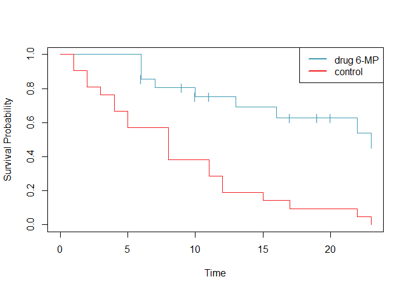

<!-- README.md is generated from README.Rmd. Please edit that file -->

# sta545package

<!-- badges: start -->

<!-- badges: end -->

The goal of the sta545package is to implement the methods in David Cox’s
1972 paper *Regression Models and Life Tables* for use in a project for
the class “STA 545: Statistical Data Mining” at the University of
Buffalo.

## Installation

You can install the released version of the sta545package from
[GitHub](https://github.com/) with:

``` r
install.packages("devtools")
devtools::install_github("mathmonster/sta545package")
```

## Examples

### Kaplan-Meier Product Limit Estimator:

``` r
library(sta545package)
plot(fitkm(remission ~ sample, delta="censor", data=leukemia))
```



### Cox Proportional Hazards Model

``` r
fitcox(remission ~ sample, delta="censor", data=leukemia)
#>                beta beta.se  lower upper     z         p
#> samplecontrol 1.572  0.4124 0.7638  2.38 3.812 0.0001378
#> 
#> n = 42, number of events = 30, distinct event times = 17
#> Likelihood ratio test: 16.35169, p = 5.260921e-05
```
