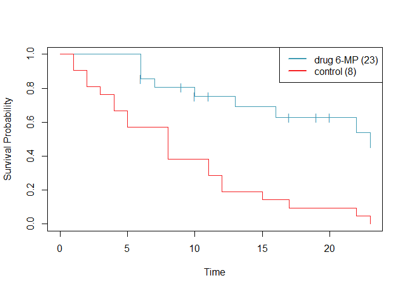

<!-- README.md is generated from README.Rmd. Please edit that file -->

# sta545package

<!-- badges: start -->

<!-- badges: end -->

The goal of the sta545package is to implement the methods in David Cox’s
1972 paper *Regression Models and Life Tables* for use in a project for
the class “STA 545: Statistical Data Mining” at the University of
Buffalo.

## Installation

You can install the released version of the sta545package from
[GitHub](https://github.com/) with:

``` r
install.packages("devtools")
devtools::install_github("mathmonster/sta545package")
```

## Examples

### Kaplan-Meier Product Limit Estimator:

``` r
library(sta545package)
plot(fitkm(remission ~ sample, delta="censor", data=leukemia))
```



### Cox Proportional Hazards Model

#### Fit a model

``` r
fitcox.leukemia <- fitcox(remission ~ sample, delta="censor", data=leukemia)
summary(fitcox.leukemia)
#>                   beta   beta.se     lower    upper        z            p
#> samplecontrol 1.572125 0.4123967 0.7638424 2.380408 3.812167 0.0001377538
```

#### Making predictions

``` r
predict(fitcox.leukemia, newdata=leukemia, type="expected")
#>  [1] 0.12494530 0.12494530 0.12494530 0.12494530 0.13831384 0.19251256
#>  [7] 0.21119193 0.21119193 0.25000051 0.33088088 0.40321139 0.44411015
#> [13] 0.44411015 0.44411015 0.56434764 0.74924395 0.74924395 0.74924395
#> [19] 0.74924395 0.74924395 0.74924395 0.07886537 0.07886537 0.16448300
#> [25] 0.16448300 0.21130019 0.30953359 0.30953359 0.41846799 0.41846799
#> [31] 0.92730867 0.92730867 0.92730867 0.92730867 1.20422089 1.20422089
#> [37] 1.43975769 1.43975769 1.75295485 2.13922250 2.71839129 3.60901345
```

#### Calculating the c-index

``` r
concordance.fitcox(fitcox(remission ~ sample, delta="censor", data=leukemia), leukemia, leukemia$remission)
#> $n.concordant
#> [1] 332
#> 
#> $n.discordant
#> [1] 104
#> 
#> $c.index
#> [1] 0.7614679
```
